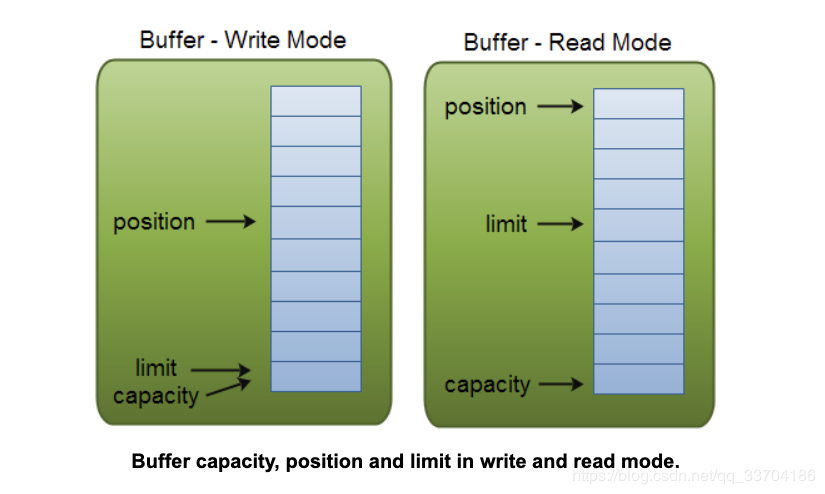

一：buffer方法介绍
flip( )方法调用将Buffer从写入模式切换到读取模式
clear( )/compact( )将Buffer从读取模式切换到写入模式。
clear( )方法清除整个Buffer。
compact( ) 方法仅清除你已读取的数据。任何未读数据都会移动到Buffer的开头

二：Buffer Capacity(容量), Position(位置) 和 Limit(限制)

capacity：总容量，不会改变
position：指的是下一次读取或写入的位置，初始化/反转为读0，读模式小于limit，写模式小于capacity
limit：最后一位元素的下一位所在的位置，初始化等于capacity，写模式下等于capacity，读模式下等
于上次position下一位(读取数据只能读到已有的数据，空余区间不行)
参考：https://www.jianshu.com/p/346b5b7098ef

三：allocate分配大小
byteBuffer.allocate(1)代表分配一个字节
charBuffer.allocate(1)代表分配一个字符
以此类推

四：将数据写入Buffer
1.将数据Channel写入Buffer:int bytesRead = inChannel.read(buf);
2.通过Buffer的put()方法，自己将数据写入缓冲区:buf.put(127);  
3.ByteBuffer.wrap(bytes),创建bytes大小的buffer，写入值，并且切换成读模式

五：从Buffer读取数据
1.将数据从Buffer读入Channel：int b ytesWritten = inChannel.write(buf);
2.使用其中的get( )方法自己从Buffer读取一个字节数据byte aByte = buf.get();
3.byteBuffer.array()

六：常用方法
1.flip()：写模式切换到读模式
2.rewind( )：将position设置回0，这样你就可以重新读取Buffer中的所有数据了。limit保持不变
3.clear( )：position设置回0和limit设置为capacity，Buffer各个位置被重置，但是数据还在，数据待
会儿会在写模式下被覆盖。如果在调用clear( )方法时缓冲区中有未读数据，该数据将丢失。
4.compact( )：将所有未读数据复制到Buffer的开头。然后它将position设置在最后一个未读元素之后。
limit属性仍然设置为capacity，就像clear( )那样。现在Buffer已准备好写入，但是不会覆盖未读数据
5.mark()和reset()
mark()方法获取position的位置并标记。然后，通过调用reset()方法将position重置回标记(mark)位置
6.equals( )要求：
*它们的类型相同（byte，char，int等）
*它们在Buffer中具有相同数量的剩余字节，字符等。
*所有剩余的字节，字符等都相等。
实际上，它只是比较Buffer中的剩余元素。
7.compareTo( )比较两个Buffer的剩余元素（字节，字符等）
在以下情况下，Buffer被视为“小于”另一个Buffer：
*与另一个Buffer中的对应元素相等的第一个元素小于另一个Buffer中的元素。
*所有元素都相等，但第一个Buffer在第二个Buffer之前耗尽了元素（它有更少的元素）。
8.allocate()和wrap()
ByteBuffer buffer = ByteBuffer.allocate(data.length);
buffer.put(data);
buffer.flip();      
*****
下面这段代码代替上面注释掉的4行代码,并且效率稍微还高一点
ByteBuffer buffer = ByteBuffer.wrap(sb.toString().getBytes());
注意wrap是静态方法，功能为新建buffer-》插入值-》读模式,wrap不能与allocate一起使用，会引起多余乱码

七：Scatter/Gather(分散读/聚合写)
1.Channel将来自Channel的数据“分散”到多个Buffer中。
//header在body前，buffer数组写入时header写满才会写body，所以header必须定长
ByteBuffer header = ByteBuffer.allocate(128);
ByteBuffer body   = ByteBuffer.allocate(1024);
ByteBuffer[] bufferArray = { header, body };
channel.read(bufferArray);
2.Channel将来自多个Buffer的数据“收集”到一个Channel中。
//顺序写入channel，header先于body，并且只会写入position与limit之间的数据，多余的不管
ByteBuffer header = ByteBuffer.allocate(128);
ByteBuffer body   = ByteBuffer.allocate(1024);
ByteBuffer[] bufferArray = { header, body };
channel.write(bufferArray);
